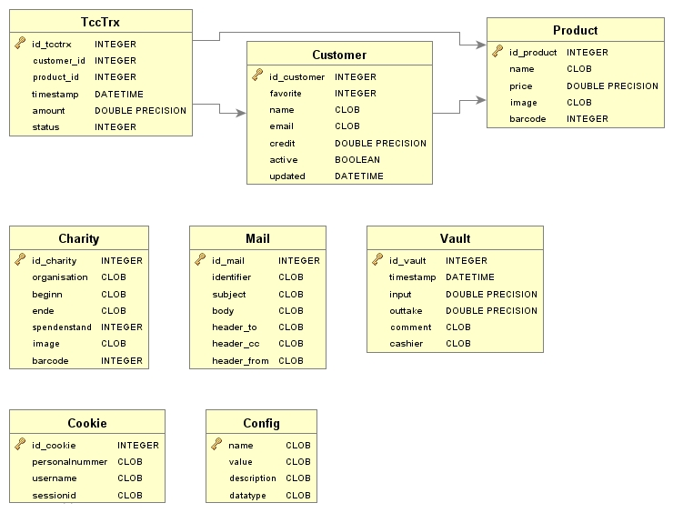

# Setup instructions
This document tries to give an overview of what has to be installed and how it has to be configured. These instructions are based on our experiences running TCC, which is but one of a multitude of different possible ways. Other options are sometimes mentioned, but you have to figure out yourself how to do that.

## Package dependencies
* Apache webserver (other webservers are possible, but below configuration snippets assume the use of Apache)
	* PHP 5.3.9 (minimum Version because of Symphony)
	* Rewrite module (mod_rewrite)
* SQLite3
* BOFH excuses for fortune (fortunes-bofh-excuses) or any other fortunes database

## Apache
### Configuration
In the scenario where client and server are running on the same system, it is possible to restrict access to the TCC website by making Apache listen only on the localhost interface. A minimalist VirtualHost stanza would look as the example below. If running client and server on different systems, make sure to limit access to the TCC website to the dedicated clients.

	<VirtualHost 127.0.0.1:80>
		ServerName		localhost

		RewriteEngine	on

		# Ensure trailing slash for certain sites
		RewriteRule		^/admin$ /admin/	[redirect,last]
		RewriteRule		^/user$ /user/		[redirect,last]
		RewriteRule		^/shop$ /shop/		[redirect,last]

		RewriteCond		%{HTTP_HOST}		!^localhost
		RewriteCond		%{REQUEST_URI}		!^/user/(.*)$
		RewriteCond		%{REQUEST_URI}		!^/bundles/(.*)$
		RewriteRule		^(.*)$ /user/		[redirect,last]

		RewriteRule		^/admin/(.*)$		/app.php/admin/$1
		RewriteRule		^/user/(.*)$		/app.php/user/$1
		RewriteRule		^/shop/(.*)$		/app.php/shop/$1

		DocumentRoot	/var/www/tcc/symfony/web
	</VirtualHost>

## Database
TCC uses SQLite as its database engine. As interface, Symfony's own Doctrine is used.

### Creation
* Create the database `symfony/app/sqlite.db`

		cd /path/to/tcc/
		php app/console doctrine:database:create
		php app/console doctrine:schema:update --force

* Make sure the Apache user has write permissions on the whole `app/` directory.
* Fill the database with initial configuration values.

		LDAPhostname=[define me]
		ldapPath=[define me]
		tccMail=[define me]

		cd /path/to/tcc/symfony/app/;

		sqlite.db "insert into Config(name, value, description, datatype) values('ldap_hostname', $LDAPhostname, 'LDAP hostname', 'string')";
		sqlite.db "insert into Config(name, value, description, datatype) values('ldap_port', '389', 'LDAP port', 'integer')";
		sqlite.db "insert into Config(name, value, description, datatype) values('ldap_password', '', 'LDAP password', 'string/password')";
		sqlite.db "insert into Config(name, value, description, datatype) values('ldap_user', $lapPath, 'LDAP user', 'string')";
		sqlite.db "insert into Config(name, value, description, datatype) values('image_path','/var/www/symfony/web/bundles/tuxcoffeecorner/img/products','Directory which contains the products' images','string')";
		sqlite.db "insert into Config(name, value, description, datatype) values('image_path_relativ','/bundles/tuxcoffeecorner/img/products/','Path by which the images are reached via browser','string')";
		sqlite.db "insert into Config(name, value, description, datatype) values('suppress_email','true', 'Whether to send mails or not','boolean')";
		sqlite.db "insert into Config(name, value, description, datatype) values('super_recipient',$tccMail ,'Mail address which will receive all mails (leave empty for normal usage)','string/email')";
		sqlite.db "insert into Config(name, value, description, datatype) values('system_name','Tux Coffee Corner','Shop name','string')";
		sqlite.db "insert into Config(name, value, description, datatype) values('system_maintainer',$tccMail,'Maintainer of coffee corner','string/email')";
		sqlite.db "insert into Config(name, value, description, datatype) values('news_text','Sorry, coffee machine out of order!','Message to display','string')";
		sqlite.db "insert into Config(name, value, description, datatype) values('news_show','false','Whether to display shop news or not','boolean')";
		sqlite.db "insert into Config(name, value, description, datatype) values('log_dir','/var/log/tcc/','Directory which contains the TCC logs','string')";
		sqlite.db "insert into Config(name, value, description, datatype) values('shop_debt_threshold','5','Negative threshold at which a reminder will be sent (if debt is bigger than)','integer')";
		sqlite.db "insert into Config(name, value, description, datatype) values('css_admin', 'admin.css', 'Name of css file for admin page', 'string')";
		sqlite.db "insert into Config(name, value, description, datatype) values('css_shop', 'shop.css', 'Name of css file for shop page', 'string')";
		sqlite.db "insert into Config(name, value, description, datatype) values('css_user', 'user.css', 'Name of css file for user page', 'string')";
		sqlite.db "insert into Config(name, value, description, datatype) values('remember_me_days', '30', 'Valid days for cookie', 'integer')";

### Default values
These are the database default values. They are hardcoded into the corresponding PHP entity class.

Note: Properties not listed have no default value and are not initialized.

* Customer:
	* name = "Anonymus";
	* credit = 0.0;
	* active = true; 
	* updated = <current timestamp (via constructor)>

* Product:
	* price = 0.0;
	* image = 'NoImage.jpg'; 

* Vault:
	* timestamp = <current timestamp (via constructor)>
	* input = 0.0;
	* outtake = 0.0;
	* comment = "";
	* cashier = "";

* Charity:
	* image = 'NoImage.jpg'; 

* TccTrx:
	* timestamp = <current timestamp (via constructor)>

### ERM

## Administration page
When all of the above has been set up, the admin page should be accessible under the path /admin. Use a modern browser.

The admin page shouldn't be accessible for anyone but the admins, obviously. An easy way to do this is by configuring Apache to only listen on the localhost interface. Admins can then e.g. use SSH port forwarding to access the page. If TCC is deployed in a client/server architecture, this had to be ensured in another way.

## Backup
Backups are important. It is recommended to back up at least the following components on a regular basis:

* SQLite database file (symfony/app/sqlite.db)
* logs (/var/log/tcc/)

